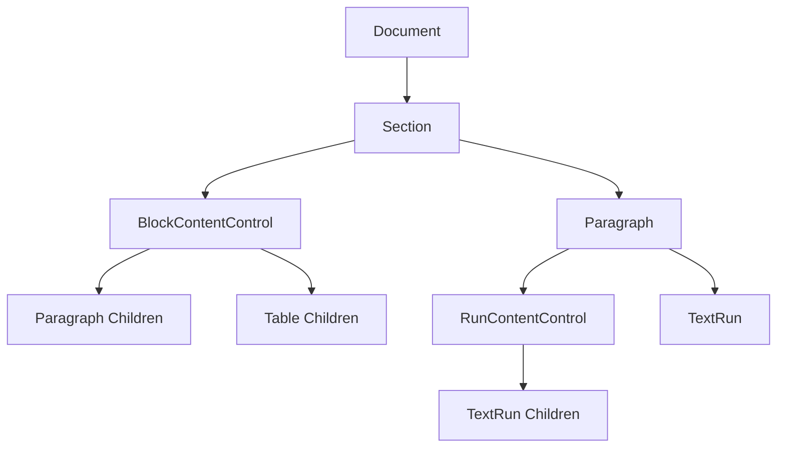
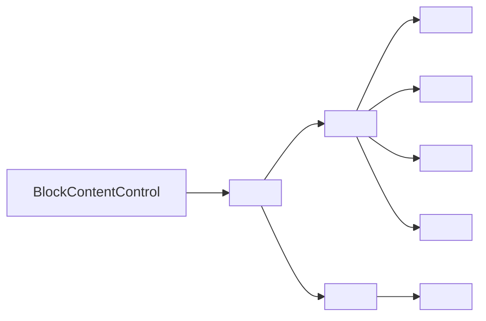

# DOCX Content Controls Implementation Spec
A technical specification for implementing programmatic Content Control creation in docx.js through forking and native integration.

## Goal
Implement native Content Control support in docx.js by forking the library and adding BlockContentControl and RunContentControl classes that generate valid OOXML.

## Problem & Context
The current `dolanmiu/docx` library lacks programmatic Content Control creation capabilities, forcing developers to rely on the `patchDocument` method for template-based population. This limitation prevents dynamic document generation and requires pre-existing Content Controls in template documents.

## Research Summary
- Sources consulted: OOXML specification, docx.js library architecture analysis
- Prior art: Existing library patterns for Paragraph/TextRun hierarchy
- Key findings: Content Controls require strict block-level/run-level separation, with `prepForXml` method as the primary integration point

## Critical Implementation Discoveries

### 🚨 **GUID Validation Requirements**
**Root Cause**: Invalid GUID formats in `dataBinding.storeItemId` cause Microsoft Word to silently reject documents.

**Problem**: Common GUID format violations that break Word compatibility:
```typescript
// ❌ INVALID - Causes Word corruption:
dataBinding: {
    xpath: "/document/data", 
    storeItemId: "{invalid-guid}"        // Missing proper hex format
    storeItemId: "{approval-guid}"       // Non-hex placeholder text
    storeItemId: "{12345}"               // Wrong length
}

// ✅ VALID - Word compatible:
dataBinding: {
    xpath: "/document/data",
    storeItemId: "{12345678-1234-5678-9ABC-123456789012}"  // Proper 32-hex format
}
```

**Solution**: Runtime GUID validation with detailed error messages:
```typescript
// Implemented in src/file/content-control/validation-utils.ts
export function validateDataBinding(dataBinding, context) {
    GuidValidator.validateGuid(dataBinding.storeItemId, `${context} dataBinding.storeItemId`);
}
```

### 🎯 **Nested Content Controls & OOXML Compliance**
**Root Cause**: OOXML specification prohibits nesting content controls inside plain text content controls.

**Problem**: This creates Word document corruption:
```typescript
// ❌ OOXML VIOLATION - Causes Word rejection:
new RunContentControl({
    tag: "DocumentInfo",
    // Missing richText: true - defaults to plain text mode
    children: [
        new RunContentControl({ ... })  // ❌ ILLEGAL NESTING!
    ]
})
```

**Solution**: Enhanced `RunContentControl` with `richText` parameter:
```typescript
// ✅ OOXML COMPLIANT - Supports nesting:
new RunContentControl({
    tag: "DocumentInfo", 
    richText: true,  // 🔧 KEY: Enables w:richText instead of w:text
    children: [
        new RunContentControl({ ... })  // ✅ Now legal!
    ]
})
```

**Technical Details**:
- `richText: false` (default) → Generates `<w:text/>` → No nesting allowed
- `richText: true` → Generates `<w:richText/>` → Nesting supported per OOXML spec
- Runtime validation prevents illegal nesting with helpful error messages

### 📚 **OOXML Specification Compliance Rules**
1. **Plain Text Controls** (`<w:text/>`) cannot contain other structured document tags
2. **Rich Text Controls** (`<w:richText/>`) can contain nested content controls
3. **Block Controls** (`BlockContentControl`) always use `<w:richText/>` for paragraph/table content
4. **GUID Format** must be exactly `{XXXXXXXX-XXXX-XXXX-XXXX-XXXXXXXXXXXX}` with hex digits
5. **Namespace Requirements** for advanced controls (e.g., `w14:checkbox` for checkboxes)

## Options Considered
- **Forking & Native Integration** — Clean implementation, type-safe, maintainable, requires build setup
- **Decision**: Forking approach for enterprise-grade robustness and maintainability

## Architecture & Diagrams



### OOXML Structure Mapping


## Plan of Action

### Phase 1: Repository Setup and Scaffolding
1. Fork the `dolanmiu/docx` repository on GitHub
2. Clone forked repository to local development environment
3. Install dependencies with `npm install`
4. Create directory structure: `src/file/content-control/`
5. Create initial files:
   - `block-content-control.ts`
   - `run-content-control.ts`
   - `dropdown-content-control.ts`
   - `date-picker-content-control.ts`
   - `checkbox-content-control.ts`
   - `picture-content-control.ts`
   - `building-block-gallery-content-control.ts`
   - `group-content-control.ts`
   - `repeating-section-content-control.ts`
   - `properties.ts` (all interfaces)
   - `index.ts` (exports)

### Phase 2: Phased Implementation Strategy

**Phase 2A: Foundation (Core Controls)**
*Target: Basic functionality for most common use cases*
- `BlockContentControl` and `RunContentControl` with all appearance and styling properties
- Enhanced property support: appearance, color, data binding, text formatting
- Comprehensive validation and error handling
- Basic test coverage

**Phase 2B: Interactive Controls**  
*Target: User input and selection controls*
- `DropdownContentControl` (both dropDownList and comboBox types)
- `DatePickerContentControl` with full calendar and formatting support
- `CheckboxContentControl` with custom symbols
- Extended test coverage for interactive scenarios

**Phase 2C: Advanced Controls**
*Target: Complex document automation*
- `PictureContentControl` for image insertion
- `BuildingBlockGalleryContentControl` for template reuse
- `GroupContentControl` for content protection
- `RepeatingSectionContentControl` for dynamic data

**Phase 2D: Enterprise Features**
*Target: Data binding and automation*
- XML data binding implementation (`dataBinding` property)
- Custom XML part integration
- Advanced validation and schema support

### Phase 2: Core Class Implementation
1. Define comprehensive TypeScript interfaces in `properties.ts`:
   ```typescript
   // Base interface for all Content Control types
   interface IContentControlProperties {
       tag: string;
       title?: string;
       
       // Visual appearance properties
       appearance?: 'boundingBox' | 'tags' | 'hidden';
       color?: string; // Hex color for control border
       
       // Locking properties
       lock?: {
           contentLock?: boolean;
           sdtLocked?: boolean;
       };
       
       // Placeholder text
       placeholder?: string;
       
       // Data binding capabilities
       dataBinding?: {
           xpath: string;
           storeItemId: string;
       };
   }

   // Enhanced text-specific properties
   interface ITextContentControlProperties extends IContentControlProperties {
       multiLine?: boolean;
       maxLength?: number;
       defaultStyle?: {
           bold?: boolean;
           italic?: boolean;
           color?: string;
           fontSize?: number;
           fontFamily?: string;
       };
       /** 
        * Enable rich text mode (allows nesting other content controls)
        * 
        * CRITICAL: When true, generates <w:richText/> enabling nested content controls.
        * When false (default), generates <w:text/> which cannot contain other content controls.
        * 
        * Use richText: true when you need to nest content controls inline.
        * @default false
        */
       richText?: boolean;
   }

   // Basic block and run control options
   interface IBlockContentControlOptions extends IContentControlProperties {
       children: (Paragraph | Table)[];
   }

   interface IRunContentControlOptions extends ITextContentControlProperties {
       children: TextRun[];
   }

   // Dropdown and ComboBox options
   interface IDropdownContentControlOptions extends ITextContentControlProperties {
       type: 'dropDownList' | 'comboBox';
       listItems: Array<{
           displayText: string;
           value: string;
       }>;
       children: TextRun[];
   }

   // Date Picker options
   interface IDatePickerContentControlOptions extends IContentControlProperties {
       dateFormat?: string; // e.g., "MM/dd/yyyy", "dd/MM/yyyy"
       calendarType?: 'gregorian' | 'hijri' | 'hebrew' | 'taiwan';
       defaultDate?: Date;
       locale?: string; // e.g., "en-US", "fr-FR"
       storeMappedDataAs?: 'text' | 'date' | 'dateTime';
       children: TextRun[];
   }

   // Checkbox options
   interface ICheckboxContentControlOptions extends IContentControlProperties {
       checked?: boolean;
       checkedSymbol?: {
           font: string;
           character: string; // Unicode value or symbol
       };
       uncheckedSymbol?: {
           font: string;
           character: string;
       };
   }

   // Picture Content Control options
   interface IPictureContentControlOptions extends IContentControlProperties {
       defaultImage?: {
           data: Buffer;
           width?: number;
           height?: number;
           altText?: string;
       };
   }

   // Building Block Gallery options
   interface IBuildingBlockGalleryContentControlOptions extends IContentControlProperties {
       gallery: 'Quick Parts' | 'Headers' | 'Footers' | 'Cover Pages' | 
                'Watermarks' | 'Page Numbers' | 'Text Boxes' | 'Equations' |
                'Tables of Contents' | 'Bibliographies';
       category?: string;
       allowDuplicates?: boolean;
       children: (Paragraph | Table)[];
   }

   // Group Content Control options
   interface IGroupContentControlOptions extends IContentControlProperties {
       children: (Paragraph | Table | BlockContentControl | RunContentControl)[];
   }

   // Repeating Section options
   interface IRepeatingSectionContentControlOptions extends IContentControlProperties {
       sectionTitle?: string;
       allowInsertAndDelete?: boolean;
       children: (Paragraph | Table)[];
   }
   ```

2. Implement core Content Control classes:

   **Phase 2A - Basic Controls:**
   - `BlockContentControl`: Rich text controls (generates `<w:richText/>`)
   - `RunContentControl`: Plain text controls (generates `<w:text/>`)

   **Phase 2B - Interactive Controls:**
   - `DropdownContentControl`: Dropdown and combo box controls (generates `<w:dropDownList/>` or `<w:comboBox/>`)
   - `DatePickerContentControl`: Date selection controls (generates `<w:date/>`)
   - `CheckboxContentControl`: Binary checkbox controls (generates `<w:checkbox/>`)

   **Phase 2C - Advanced Controls:**
   - `PictureContentControl`: Image insertion controls (generates `<w:picture/>`)
   - `BuildingBlockGalleryContentControl`: Gallery selection controls (generates `<w:docPartObj/>`)
   - `GroupContentControl`: Protected content grouping (generates `<w:group/>`)
   - `RepeatingSectionContentControl`: Dynamic content repetition (generates `<w:repeatingSection/>`)

   **Common Implementation Requirements:**
   - Auto-generate unique ID for `<w:id>` property using existing convenience functions
   - Implement `prepForXml` method returning correct OOXML structure for each type
   - Generate appropriate type-specific elements and properties
   - Validate children based on control type constraints
   - Handle all property mappings to OOXML attributes (appearance, color, data binding, etc.)
   - Implement proper error handling for invalid configurations

### Phase 3: Integration and Library Exposure
1. Modify `src/index.ts` to export new classes and interfaces
2. Ensure classes integrate with existing object model:
   - `BlockContentControl` valid child of `Section`
   - `RunContentControl` valid child of `Paragraph`
3. Follow existing library patterns for consistency

### Phase 4: Testing and Validation
1. Create comprehensive test file: `demo/99-content-controls.ts`
2. Test cases for both control types with various options
3. Validate generated OOXML against canonical structure:
   ```xml
   <w:sdt>
     <w:sdtPr>
       <w:alias w:val="Rich Text Title"/>
       <w:tag w:val="RichTextTag"/>
       <w:id w:val="-1588270923"/>
       <w:richText/>
       <w:showingPlcHdr/>
     </w:sdtPr>
     <w:sdtContent>
       <w:p>
         <w:r>
           <w:t>Placeholder content</w:t>
         </w:r>
       </w:p>
     </w:sdtContent>
   </w:sdt>
   ```

### Phase 5: Build and Deployment
1. Run library build: `npm run build`
2. Deploy via `npm link` for local development
3. Publish to private npm registry for production use
4. Maintain fork with periodic upstream merges

## Usage Examples

### 1. Enhanced Block Content Control with Styling
```typescript
import { Document, Packer, BlockContentControl, Paragraph, TextRun } from "docx";

const doc = new Document({
    sections: [{
        children: [
            new BlockContentControl({
                tag: "CustomerAddress",
                title: "Customer Address Block",
                placeholder: "Click here to enter customer address",
                appearance: 'boundingBox',
                color: '#0066CC',
                lock: { sdtLocked: true },
                children: [
                    new Paragraph({
                        children: [new TextRun({
                            text: "Customer Name",
                            bold: true
                        })]
                    }),
                    new Paragraph({
                        children: [new TextRun("123 Main Street")]
                    }),
                    new Paragraph({
                        children: [new TextRun("City, State 12345")]
                    })
                ]
            })
        ]
    }]
});
```

### 2. Enhanced Run Content Control with Text Formatting
```typescript
const doc = new Document({
    sections: [{
        children: [
            new Paragraph({
                children: [
                    new TextRun("Customer: "),
                    new RunContentControl({
                        tag: "CustomerName",
                        title: "Customer Name",
                        placeholder: "Enter customer name",
                        appearance: 'tags',
                        multiLine: false,
                        maxLength: 100,
                        defaultStyle: {
                            bold: true,
                            color: '#0066CC'
                        },
                        children: [new TextRun("[Customer Name]")]
                    })
                ]
            })
        ]
    }]
});
```

### 3. Dropdown Content Control
```typescript
const doc = new Document({
    sections: [{
        children: [
            new Paragraph({
                children: [
                    new TextRun("Priority: "),
                    new DropdownContentControl({
                        tag: "Priority",
                        title: "Task Priority",
                        type: 'dropDownList',
                        listItems: [
                            { displayText: "High", value: "high" },
                            { displayText: "Medium", value: "medium" },
                            { displayText: "Low", value: "low" }
                        ],
                        children: [new TextRun("Medium")]
                    })
                ]
            })
        ]
    }]
});
```

### 4. Date Picker Content Control
```typescript
const doc = new Document({
    sections: [{
        children: [
            new Paragraph({
                children: [
                    new TextRun("Due Date: "),
                    new DatePickerContentControl({
                        tag: "DueDate",
                        title: "Project Due Date",
                        dateFormat: "MM/dd/yyyy",
                        calendarType: 'gregorian',
                        locale: "en-US",
                        defaultDate: new Date(),
                        storeMappedDataAs: 'dateTime',
                        children: [new TextRun("12/19/2024")]
                    })
                ]
            })
        ]
    }]
});
```

### 5. Checkbox Content Control
```typescript
const doc = new Document({
    sections: [{
        children: [
            new Paragraph({
                children: [
                    new CheckboxContentControl({
                        tag: "Approved",
                        title: "Approval Status",
                        checked: false,
                        checkedSymbol: { font: "Wingdings", character: "☑" },
                        uncheckedSymbol: { font: "Wingdings", character: "☐" }
                    }),
                    new TextRun(" Document Approved")
                ]
            })
        ]
    }]
});
```

### 6. Building Block Gallery Content Control
```typescript
const doc = new Document({
    sections: [{
        children: [
            new BuildingBlockGalleryContentControl({
                tag: "CompanyHeader",
                title: "Select Company Header",
                gallery: 'Headers',
                category: 'Corporate',
                allowDuplicates: false,
                children: [
                    new Paragraph({
                        children: [new TextRun("Click to select a header...")]
                    })
                ]
            })
        ]
    }]
});
```

### 7. Group Content Control
```typescript
const doc = new Document({
    sections: [{
        children: [
            new GroupContentControl({
                tag: "ContractTerms",
                title: "Contract Terms Section",
                lock: { contentLock: false, sdtLocked: true },
                children: [
                    new Paragraph({
                        children: [new TextRun("TERMS AND CONDITIONS", { bold: true })]
                    }),
                    new RunContentControl({
                        tag: "Term1",
                        children: [new TextRun("Payment terms...")]
                    }),
                    new RunContentControl({
                        tag: "Term2", 
                        children: [new TextRun("Delivery terms...")]
                    })
                ]
            })
        ]
    }]
});
```

### 8. Repeating Section Content Control
```typescript
const doc = new Document({
    sections: [{
        children: [
            new RepeatingSectionContentControl({
                tag: "InvoiceItems",
                title: "Invoice Line Items",
                sectionTitle: "Item",
                allowInsertAndDelete: true,
                children: [
                    new Paragraph({
                        children: [
                            new TextRun("Item: "),
                            new RunContentControl({
                                tag: "ItemName",
                                children: [new TextRun("[Item Name]")]
                            }),
                            new TextRun(" - Price: $"),
                            new RunContentControl({
                                tag: "ItemPrice",
                                children: [new TextRun("0.00")]
                            })
                        ]
                    })
                ]
            })
        ]
    }]
});
```

### 9. Data-Bound Content Control
```typescript
const doc = new Document({
    sections: [{
        children: [
            new RunContentControl({
                tag: "CustomerData",
                title: "Customer Information",
                dataBinding: {
                    xpath: "/root/customer/name",
                    storeItemId: "{12345678-1234-1234-1234-123456789012}"
                },
                children: [new TextRun("[Customer Name from XML]")]
            })
        ]
    }]
});
```

## Interfaces (APIs/Models)

### Core Classes

**Basic Content Controls:**
- `BlockContentControl`: Rich text controls with paragraph/table children (SdtBlock)
- `RunContentControl`: Plain text controls with text run children (SdtRun)

**Interactive Content Controls:**
- `DropdownContentControl`: Dropdown list and combo box controls
- `DatePickerContentControl`: Date selection with calendar interface
- `CheckboxContentControl`: Binary checkbox with custom symbols

**Advanced Content Controls:**
- `PictureContentControl`: Image insertion and replacement controls
- `BuildingBlockGalleryContentControl`: Building block selection from galleries
- `GroupContentControl`: Protected content grouping and organization
- `RepeatingSectionContentControl`: Dynamic content repetition for data binding

**Specialized Features:**
- Enhanced appearance options: `boundingBox`, `tags`, `hidden`
- Color customization for control borders
- Text formatting properties: multi-line, max length, default styling
- Data binding capabilities with custom XML parts
- Comprehensive locking mechanisms for content protection

### Key Methods
- `prepForXml(context)`: Primary serialization method returning intermediate XML structure
- Constructor with options validation and ID generation

### Integration Points
- Section children array accepts `BlockContentControl`
- Paragraph children array accepts `RunContentControl`

## Success Metrics & Validation
- Generated OOXML validates against Microsoft Word requirements
- Controls appear correctly in Word document interface
- Classes integrate seamlessly with existing docx.js patterns
- Type safety maintained throughout implementation
- No breaking changes to existing library functionality

## Test Plan

### Testing Framework & Structure
- **Framework**: Vitest (following existing repository patterns)
- **Location**: Co-located spec files for each control type:
  - `src/file/content-control/block-content-control.spec.ts`
  - `src/file/content-control/run-content-control.spec.ts`
  - `src/file/content-control/dropdown-content-control.spec.ts`
  - `src/file/content-control/date-picker-content-control.spec.ts`
  - `src/file/content-control/checkbox-content-control.spec.ts`
  - `src/file/content-control/picture-content-control.spec.ts`
  - `src/file/content-control/building-block-gallery-content-control.spec.ts`
  - `src/file/content-control/group-content-control.spec.ts`
  - `src/file/content-control/repeating-section-content-control.spec.ts`
- **Mocking**: Mock unique ID generation for predictable tests using `vi.spyOn(convenienceFunctions, "uniqueId")`

### Critical Validation Tests
**These tests are ESSENTIAL to prevent Word document corruption:**

#### GUID Validation Tests
```typescript
describe("GUID Validation", () => {
    it("should accept valid GUID format", () => {
        expect(() => {
            new RunContentControl({
                tag: "TestTag",
                dataBinding: {
                    xpath: "/document/data",
                    storeItemId: "{12345678-1234-5678-9ABC-123456789012}"  // ✅ Valid
                },
                children: [new TextRun("Test")]
            });
        }).not.toThrow();
    });

    it("should reject invalid GUID format", () => {
        expect(() => {
            new RunContentControl({
                tag: "TestTag", 
                dataBinding: {
                    xpath: "/document/data",
                    storeItemId: "{invalid-guid}"  // ❌ Invalid - will break Word
                },
                children: [new TextRun("Test")]
            });
        }).toThrowError("Invalid GUID format");
    });

    it("should provide helpful error message for GUID validation", () => {
        expect(() => {
            new RunContentControl({
                tag: "TestTag",
                dataBinding: { xpath: "/data", storeItemId: "{approval-guid}" },
                children: [new TextRun("Test")]
            });
        }).toThrowError(/GUIDs must follow the format \{XXXXXXXX-XXXX-XXXX-XXXX-XXXXXXXXXXXX\}/);
    });
});
```

#### Nesting Validation Tests
```typescript
describe("Content Control Nesting Validation", () => {
    it("should allow nesting with richText: true", () => {
        expect(() => {
            new RunContentControl({
                tag: "Parent",
                richText: true,  // ✅ Enables nesting
                children: [
                    new TextRun("Before: "),
                    new RunContentControl({
                        tag: "Child",
                        children: [new TextRun("Nested")]
                    })
                ]
            });
        }).not.toThrow();
    });

    it("should prevent illegal nesting with richText: false", () => {
        expect(() => {
            new RunContentControl({
                tag: "Parent",
                richText: false,  // ❌ Plain text mode - no nesting allowed  
                children: [
                    new TextRun("Before: "),
                    new RunContentControl({  // This will throw
                        tag: "Child",
                        children: [new TextRun("Nested")]
                    })
                ]
            });
        }).toThrowError(/nesting error.*plain text RunContentControl/);
    });

    it("should provide helpful nesting violation error", () => {
        expect(() => {
            new RunContentControl({
                tag: "Parent",
                // Missing richText: true
                children: [
                    new RunContentControl({ tag: "Child", children: [new TextRun("Test")] })
                ]
            });
        }).toThrowError(/SOLUTIONS.*richText: true/);
    });
});
```

#### OOXML Compliance Tests  
```typescript
describe("OOXML Compliance", () => {
    it("should generate w:text for plain text mode", () => {
        const control = new RunContentControl({
            tag: "PlainText",
            richText: false,
            children: [new TextRun("Plain")]
        });
        
        const xml = new Formatter().format(control);
        expect(xml["w:sdt"][0]["w:sdtPr"]).to.deep.include({ "w:text": {} });
    });

    it("should generate w:richText for rich text mode", () => {
        const control = new RunContentControl({
            tag: "RichText", 
            richText: true,
            children: [new TextRun("Rich")]
        });
        
        const xml = new Formatter().format(control);
        expect(xml["w:sdt"][0]["w:sdtPr"]).to.deep.include({ "w:richText": {} });
    });
});
```

### Unit Test Categories

#### Constructor Tests
```typescript
describe("BlockContentControl", () => {
    beforeEach(() => {
        vi.spyOn(convenienceFunctions, "uniqueId").mockReturnValue("test-unique-id");
    });

    afterEach(() => {
        vi.restoreAllMocks();
    });

    describe("#constructor()", () => {
        it("should create valid JSON", () => {
            const control = new BlockContentControl({
                tag: "TestTag",
                children: [new Paragraph("Test content")]
            });
            const stringifiedJson = JSON.stringify(control);
            // Should not throw
            JSON.parse(stringifiedJson);
        });

        it("should generate unique ID automatically", () => {
            const control = new BlockContentControl({
                tag: "TestTag", 
                children: [new Paragraph("Test")]
            });
            expect(control).to.have.property('id');
        });

        it("should throw error for invalid children", () => {
            expect(() => new BlockContentControl({
                tag: "TestTag",
                children: [new TextRun("Invalid")] // TextRun not allowed in block control
            })).to.throw();
        });
    });
});
```

#### OOXML Generation Tests  
```typescript
describe("#prepForXml()", () => {
    it("should generate correct OOXML structure for block control", () => {
        const control = new BlockContentControl({
            tag: "RichTextTag",
            title: "Rich Text Title",
            children: [new Paragraph("Placeholder content")]
        });
        
        const tree = new Formatter().format(control);
        expect(tree).to.deep.equal({
            "w:sdt": [
                {
                    "w:sdtPr": [
                        { "w:alias": { _attr: { "w:val": "Rich Text Title" } } },
                        { "w:tag": { _attr: { "w:val": "RichTextTag" } } },
                        { "w:id": { _attr: { "w:val": "test-unique-id" } } },
                        { "w:richText": {} },
                        { "w:showingPlcHdr": {} }
                    ]
                },
                {
                    "w:sdtContent": [
                        {
                            "w:p": [
                                {
                                    "w:r": [
                                        { "w:t": "Placeholder content" }
                                    ]
                                }
                            ]
                        }
                    ]
                }
            ]
        });
    });

    it("should generate correct OOXML for run control", () => {
        const control = new RunContentControl({
            tag: "PlainTextTag",
            children: [new TextRun("Inline content")]
        });
        
        const tree = new Formatter().format(control);
        expect(tree).to.deep.equal({
            "w:sdt": [
                {
                    "w:sdtPr": [
                        { "w:tag": { _attr: { "w:val": "PlainTextTag" } } },
                        { "w:id": { _attr: { "w:val": "test-unique-id" } } },
                        { "w:text": {} }
                    ]
                },
                {
                    "w:sdtContent": [
                        {
                            "w:r": [
                                { "w:t": "Inline content" }
                            ]
                        }
                    ]
                }
            ]
        });
    });

    it("should include lock properties when specified", () => {
        const control = new BlockContentControl({
            tag: "LockedTag",
            lock: { contentLock: true, sdtLocked: true },
            children: [new Paragraph("Locked content")]
        });
        
        const tree = new Formatter().format(control);
        const lockElement = tree["w:sdt"][0]["w:sdtPr"].find(el => el["w:lock"]);
        expect(lockElement).to.exist;
        expect(lockElement["w:lock"]._attr).to.deep.equal({
            "w:contentLocked": "1",
            "w:sdtLocked": "1"
        });
    });
});

// Tests for specialized content control types
describe("DropdownContentControl", () => {
    it("should generate correct OOXML for dropdown list", () => {
        const control = new DropdownContentControl({
            tag: "PriorityDropdown",
            type: 'dropDownList',
            listItems: [
                { displayText: "High", value: "high" },
                { displayText: "Medium", value: "medium" }
            ],
            children: [new TextRun("Medium")]
        });
        
        const tree = new Formatter().format(control);
        const sdtPr = tree["w:sdt"][0]["w:sdtPr"];
        const dropDownList = sdtPr.find(el => el["w:dropDownList"]);
        expect(dropDownList).to.exist;
        expect(dropDownList["w:dropDownList"]).to.have.lengthOf(2);
    });

    it("should generate correct OOXML for combo box", () => {
        const control = new DropdownContentControl({
            tag: "ComboTest",
            type: 'comboBox',
            listItems: [{ displayText: "Option 1", value: "opt1" }],
            children: [new TextRun("Option 1")]
        });
        
        const tree = new Formatter().format(control);
        const comboBox = tree["w:sdt"][0]["w:sdtPr"].find(el => el["w:comboBox"]);
        expect(comboBox).to.exist;
    });
});

describe("DatePickerContentControl", () => {
    it("should generate correct OOXML for date picker", () => {
        const control = new DatePickerContentControl({
            tag: "DueDatePicker",
            dateFormat: "MM/dd/yyyy",
            calendarType: 'gregorian',
            locale: "en-US",
            children: [new TextRun("12/19/2024")]
        });
        
        const tree = new Formatter().format(control);
        const dateElement = tree["w:sdt"][0]["w:sdtPr"].find(el => el["w:date"]);
        expect(dateElement).to.exist;
        expect(dateElement["w:date"]["w:dateFormat"]._attr["w:val"]).to.equal("MM/dd/yyyy");
    });
});

describe("CheckboxContentControl", () => {
    it("should generate correct OOXML for checkbox", () => {
        const control = new CheckboxContentControl({
            tag: "ApprovalCheckbox",
            checked: true,
            checkedSymbol: { font: "Wingdings", character: "☑" },
            uncheckedSymbol: { font: "Wingdings", character: "☐" }
        });
        
        const tree = new Formatter().format(control);
        const checkboxElement = tree["w:sdt"][0]["w:sdtPr"].find(el => el["w:checkbox"]);
        expect(checkboxElement).to.exist;
        expect(checkboxElement["w:checkbox"]["w:checked"]._attr["w:val"]).to.equal("true");
    });
});

describe("BuildingBlockGalleryContentControl", () => {
    it("should generate correct OOXML for building block gallery", () => {
        const control = new BuildingBlockGalleryContentControl({
            tag: "HeaderGallery",
            gallery: 'Headers',
            category: 'Corporate',
            allowDuplicates: false,
            children: [new Paragraph("Select header...")]
        });
        
        const tree = new Formatter().format(control);
        const docPartObj = tree["w:sdt"][0]["w:sdtPr"].find(el => el["w:docPartObj"]);
        expect(docPartObj).to.exist;
        expect(docPartObj["w:docPartObj"]["w:docPartGallery"]._attr["w:val"]).to.equal("Headers");
    });
});
```

### Property-Specific Tests
```typescript
describe("Enhanced Properties", () => {
    it("should handle appearance properties", () => {
        const control = new BlockContentControl({
            tag: "AppearanceTest",
            appearance: 'tags',
            color: '#FF0000',
            children: [new Paragraph("Content")]
        });
        
        const tree = new Formatter().format(control);
        const sdtPr = tree["w:sdt"][0]["w:sdtPr"];
        
        expect(sdtPr.find(el => el["w:appearance"])).to.exist;
        expect(sdtPr.find(el => el["w:color"])).to.exist;
    });

    it("should handle text formatting properties", () => {
        const control = new RunContentControl({
            tag: "TextFormattingTest",
            multiLine: true,
            maxLength: 255,
            defaultStyle: {
                bold: true,
                color: '#0066CC'
            },
            children: [new TextRun("Formatted text")]
        });
        
        const tree = new Formatter().format(control);
        const textElement = tree["w:sdt"][0]["w:sdtPr"].find(el => el["w:text"]);
        expect(textElement["w:text"]["w:multiLine"]).to.exist;
        expect(textElement["w:text"]["w:maxLength"]._attr["w:val"]).to.equal("255");
    });

    it("should handle data binding properties", () => {
        const control = new RunContentControl({
            tag: "DataBoundTest",
            dataBinding: {
                xpath: "/root/customer/name",
                storeItemId: "{12345678-1234-1234-1234-123456789012}"
            },
            children: [new TextRun("Customer Name")]
        });
        
        const tree = new Formatter().format(control);
        const dataBinding = tree["w:sdt"][0]["w:sdtPr"].find(el => el["w:dataBinding"]);
        expect(dataBinding).to.exist;
        expect(dataBinding["w:dataBinding"]._attr["w:xpath"]).to.equal("/root/customer/name");
    });
});
```

### Integration Tests

#### Document Integration Tests
```typescript
describe("Document Integration", () => {
    it("should integrate BlockContentControl in Section children", () => {
        const doc = new Document({
            sections: [{
                children: [
                    new Paragraph("Before control"),
                    new BlockContentControl({
                        tag: "TestBlock",
                        children: [new Paragraph("Inside control")]
                    }),
                    new Paragraph("After control")
                ]
            }]
        });
        
        const tree = new Formatter().format(doc);
        // Verify the structure includes the content control
        expect(tree).to.have.nested.property('w:document.w:body');
    });

    it("should integrate RunContentControl in Paragraph children", () => {
        const para = new Paragraph({
            children: [
                new TextRun("Before "),
                new RunContentControl({
                    tag: "InlineTag",
                    children: [new TextRun("inline control")]
                }),
                new TextRun(" after")
            ]
        });
        
        const tree = new Formatter().format(para);
        expect(tree["w:p"]).to.have.lengthOf(3); // TextRun + SDT + TextRun
    });
});
```

### Validation Utilities Implementation
**Location**: `src/file/content-control/validation-utils.ts`

This critical utility module prevents Word document corruption through runtime validation:

```typescript
export class GuidValidator {
    private static readonly GUID_REGEX = /^{[0-9A-Fa-f]{8}-[0-9A-Fa-f]{4}-[0-9A-Fa-f]{4}-[0-9A-Fa-f]{4}-[0-9A-Fa-f]{12}}$/;

    public static validateGuid(guid: string, context: string = "GUID"): void {
        if (!this.isValidGuid(guid)) {
            throw new Error(
                `${context}: Invalid GUID format "${guid}". ` +
                `GUIDs must follow the format {XXXXXXXX-XXXX-XXXX-XXXX-XXXXXXXXXXXX} where X is a hexadecimal digit. ` +
                `Example: "{12345678-1234-5678-9ABC-123456789012}". This validation prevents document corruption.`
            );
        }
    }
}

export function validateDataBinding(dataBinding: { readonly xpath: string; readonly storeItemId: string }, context: string): void {
    if (!dataBinding.xpath || dataBinding.xpath.trim().length === 0) {
        throw new Error(`${context} dataBinding.xpath: XPath is required and cannot be empty.`);
    }
    GuidValidator.validateGuid(dataBinding.storeItemId, `${context} dataBinding.storeItemId`);
}
```

**Integration**: All content control constructors must call `validateDataBinding()` when `dataBinding` is provided:
```typescript
// In constructor of every content control class:
if (options.dataBinding) {
    validateDataBinding(options.dataBinding, "RunContentControl");
}
```

### Common Pitfalls & Best Practices

#### ❌ **Common Mistakes That Break Word Documents:**

1. **Invalid GUID Formats**:
   ```typescript
   // ❌ These will cause silent Word failures:
   storeItemId: "{approval-guid}"     // Non-hex characters
   storeItemId: "{12345}"             // Wrong length
   storeItemId: "12345678-1234..."    // Missing braces
   storeItemId: "{12345678-12345678}" // Wrong format
   ```

2. **Illegal Content Control Nesting**:
   ```typescript
   // ❌ This violates OOXML and corrupts documents:
   new RunContentControl({
       tag: "Parent",
       // Missing richText: true
       children: [
           new RunContentControl({ ... }) // Illegal nesting!
       ]
   })
   ```

3. **Wrong Control Types for Use Cases**:
   ```typescript
   // ❌ Wrong - Use BlockContentControl for multi-paragraph content:
   new RunContentControl({
       children: [
           new Paragraph("Para 1"),  // RunContentControl only accepts TextRun[]
           new Paragraph("Para 2")
       ]
   })
   ```

#### ✅ **Best Practices:**

1. **Always Use Valid GUIDs**:
   ```typescript
   // ✅ Use proper 32-hex-digit format:
   import { v4 as uuidv4 } from 'uuid';
   const validGuid = `{${uuidv4().toUpperCase()}}`;
   
   dataBinding: {
       xpath: "/document/data",
       storeItemId: validGuid  // Always valid
   }
   ```

2. **Enable Rich Text for Nesting**:
   ```typescript
   // ✅ Explicitly enable nesting support:
   new RunContentControl({
       tag: "Parent",
       richText: true,  // Required for nesting!
       children: [
           new TextRun("Label: "),
           new RunContentControl({ ... }) // Now legal
       ]
   })
   ```

3. **Choose Appropriate Control Types**:
   ```typescript
   // ✅ RunContentControl for inline content:
   new RunContentControl({
       tag: "Name", 
       children: [new TextRun("John Doe")]
   })
   
   // ✅ BlockContentControl for multi-paragraph content:
   new BlockContentControl({
       tag: "Address",
       children: [
           new Paragraph("123 Main St"),
           new Paragraph("City, State 12345")
       ]
   })
   ```

4. **Validate Early and Often**:
   ```typescript
   // ✅ Test content controls immediately after creation:
   const control = new RunContentControl({ ... });
   
   // Verify XML generation works:
   const formatter = new Formatter();
   const xml = formatter.format(control);
   console.log("Generated XML:", xml);
   ```

### Property Validation Tests
```typescript
describe("Property Validation", () => {
    it("should handle all supported properties", () => {
        const control = new BlockContentControl({
            tag: "FullTest",
            title: "Full Test Title",
            placeholder: "Click here to enter text",
            lock: { contentLock: true },
            children: [new Paragraph("Content")]
        });
        
        const tree = new Formatter().format(control);
        const sdtPr = tree["w:sdt"][0]["w:sdtPr"];
        
        expect(sdtPr).to.deep.include({ "w:alias": { _attr: { "w:val": "Full Test Title" } } });
        expect(sdtPr).to.deep.include({ "w:showingPlcHdr": {} });
    });

    it("should use default values for optional properties", () => {
        const control = new BlockContentControl({
            tag: "MinimalTest",
            children: [new Paragraph("Content")]
        });
        
        const tree = new Formatter().format(control);
        const sdtPr = tree["w:sdt"][0]["w:sdtPr"];
        
        // Should have tag, id, and richText but not alias or showingPlcHdr
        expect(sdtPr.find(el => el["w:tag"])).to.exist;
        expect(sdtPr.find(el => el["w:id"])).to.exist;
        expect(sdtPr.find(el => el["w:richText"])).to.exist;
        expect(sdtPr.find(el => el["w:alias"])).to.not.exist;
        expect(sdtPr.find(el => el["w:showingPlcHdr"])).to.not.exist;
    });
});
```

### Edge Case Tests
```typescript
describe("Edge Cases", () => {
    it("should handle empty children array", () => {
        expect(() => new BlockContentControl({
            tag: "EmptyTest",
            children: []
        })).to.throw("Content Controls must have at least one child element");
    });

    it("should generate unique IDs for multiple controls", () => {
        vi.spyOn(convenienceFunctions, "uniqueId")
          .mockReturnValueOnce("id-1")
          .mockReturnValueOnce("id-2");
          
        const control1 = new BlockContentControl({
            tag: "Test1",
            children: [new Paragraph("Content 1")]
        });
        
        const control2 = new BlockContentControl({
            tag: "Test2", 
            children: [new Paragraph("Content 2")]
        });
        
        expect(control1.id).to.equal("id-1");
        expect(control2.id).to.equal("id-2");
    });
});
```

### Packer Integration Tests
```typescript
describe("Packer Integration", () => {
    it("should call prepForXml method exactly once during packing", () => {
        const control = new BlockContentControl({
            tag: "PackerTest",
            children: [new Paragraph("Test")]
        });
        
        const spy = vi.spyOn(control, "prepForXml");
        const formatter = new Formatter();
        formatter.format(control);
        
        expect(spy).toBeCalledTimes(1);
    });

    it("should produce valid .docx file with Content Controls", async () => {
        const doc = new Document({
            sections: [{
                children: [
                    new BlockContentControl({
                        tag: "TestControl",
                        title: "Test Control",
                        children: [new Paragraph("Test content")]
                    })
                ]
            }]
        });
        
        const buffer = await Packer.toBuffer(doc);
        expect(buffer).to.be.instanceOf(Buffer);
        expect(buffer.length).to.be.greaterThan(0);
    });
});
```

### Test Data & Fixtures
- **Canonical OOXML Fixtures**: Store expected XML output in fixture files for comparison
- **Sample Documents**: Create reference .docx files with manually created Content Controls for validation
- **Test Document Templates**: Various combinations of controls, properties, and document structures

### Manual Testing Protocol
1. **Word Document Validation**: 
   - Open generated documents in Microsoft Word
   - Verify Content Controls appear in Developer tab
   - Test control selection, editing, and property dialogs
   - Validate placeholder text behavior

2. **Cross-Platform Testing**:
   - Test on Windows and macOS versions of Word
   - Validate in Word Online
   - Test with LibreOffice Writer for compatibility

### Performance Testing
```typescript
describe("Performance", () => {
    it("should handle large numbers of controls efficiently", () => {
        const startTime = Date.now();
        
        const controls = Array.from({ length: 1000 }, (_, i) => 
            new BlockContentControl({
                tag: `Control${i}`,
                children: [new Paragraph(`Content ${i}`)]
            })
        );
        
        const doc = new Document({
            sections: [{ children: controls }]
        });
        
        const endTime = Date.now();
        expect(endTime - startTime).to.be.lessThan(1000); // Should complete in under 1 second
    });
});
```

### Exit Criteria

**Phase 2A (Basic Controls) Exit Criteria:**
1. **Core functionality**: BlockContentControl and RunContentControl with all enhanced properties
2. **OOXML validation**: Generated XML matches canonical structure for rich text and plain text controls
3. **Appearance features**: boundingBox, tags, hidden appearance modes working
4. **Enhanced properties**: Color, data binding, text formatting all functional
5. **Unit test coverage**: 100% coverage for basic controls with comprehensive edge case testing
6. **Manual verification**: Controls render and function correctly in Microsoft Word

**Phase 2B (Interactive Controls) Exit Criteria:**
1. **Dropdown functionality**: Both dropDownList and comboBox types working with list items
2. **Date picker functionality**: Calendar interface, format strings, locale support working
3. **Checkbox functionality**: Custom symbols, checked/unchecked states working  
4. **Integration tests**: All interactive controls work within document hierarchy
5. **OOXML validation**: Specialized elements (w:dropDownList, w:date, w:checkbox) generate correctly
6. **User interaction**: Controls respond correctly to user input in Microsoft Word

**Phase 2C (Advanced Controls) Exit Criteria:**
1. **Picture controls**: Image insertion and replacement functionality working
2. **Building block galleries**: Gallery selection, category filtering working
3. **Group controls**: Content protection and nested control support working
4. **Repeating sections**: Dynamic content repetition and data binding working
5. **Complex scenarios**: Nested controls, mixed content types all functional
6. **Performance validation**: Large documents with many controls perform acceptably

**Phase 2D (Enterprise Features) Exit Criteria:**
1. **Data binding**: XML mapping and custom XML parts fully implemented
2. **Schema validation**: Custom XML schema support and validation working
3. **Advanced automation**: Programmatic data population from external sources
4. **Enterprise integration**: Support for CMS and document automation workflows

**Overall Project Exit Criteria:**
1. **Complete test suite**: 100% coverage across all content control types
2. **Cross-platform validation**: Works correctly on Windows/Mac Word and Word Online
3. **Performance benchmarks**: No significant degradation vs. existing library performance
4. **Type safety**: Full TypeScript coverage with no `any` types
5. **Documentation**: Complete API documentation with working examples for all control types
6. **Production readiness**: Error handling, validation, and edge case coverage complete

## Risks & Mitigations
1. **OOXML Complexity**: Mitigate by strict adherence to specification and extensive testing
2. **Library Integration Issues**: Follow existing patterns closely, validate with comprehensive tests
3. **Upstream Maintenance**: Establish regular merge schedule from upstream repository

## Open Questions
- Should we support all Content Control types initially or implement incrementally?
- What's the preferred approach for handling unique ID generation conflicts?
- Should the implementation include additional validation beyond basic type checking?

## Changelog
- 2024-12-19: Created. Focused implementation spec derived from strategic analysis, removed monkey-patching approach and executive summary.
